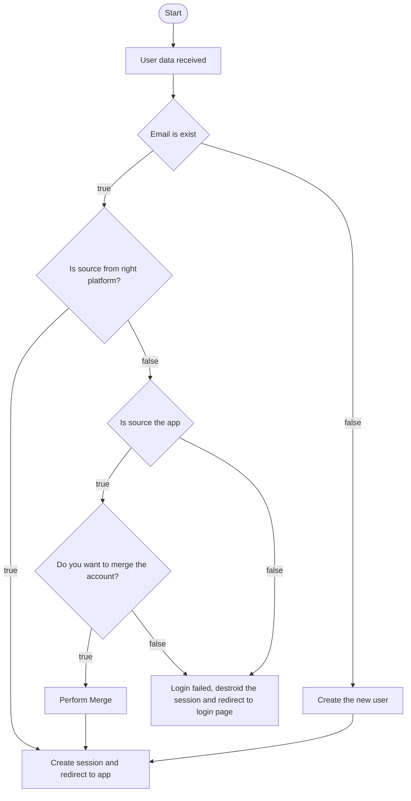

# Login via 3rd party 

```mermaid
flowchart TB
  START(["Start"])-->SucLog["User data received"];
  SucLog-->QEmailExist{"Email is exist"};
  QEmailExist--true-->QisSourceRight{"Is source from right platform?"};
  QisSourceRight--true-->CreateSession["Create session and redirect to app"];
  QisSourceRight--false-->QisSourceApp{"Is source the app"};
  QisSourceApp--true-->QMergeAccount{"Do you want to merge the account?"};
  QMergeAccount--true-->PerformMerge["Perform Merge"];
  PerformMerge-->CreateSession;
  QMergeAccount--false-->LoginFailed["Login failed, destroid the session and redirect to login page"];
  QisSourceApp--false-->LoginFailed;
  QEmailExist--false-->CreateNewUser["Create the new user"];
  CreateNewUser-->CreateSession;
```
