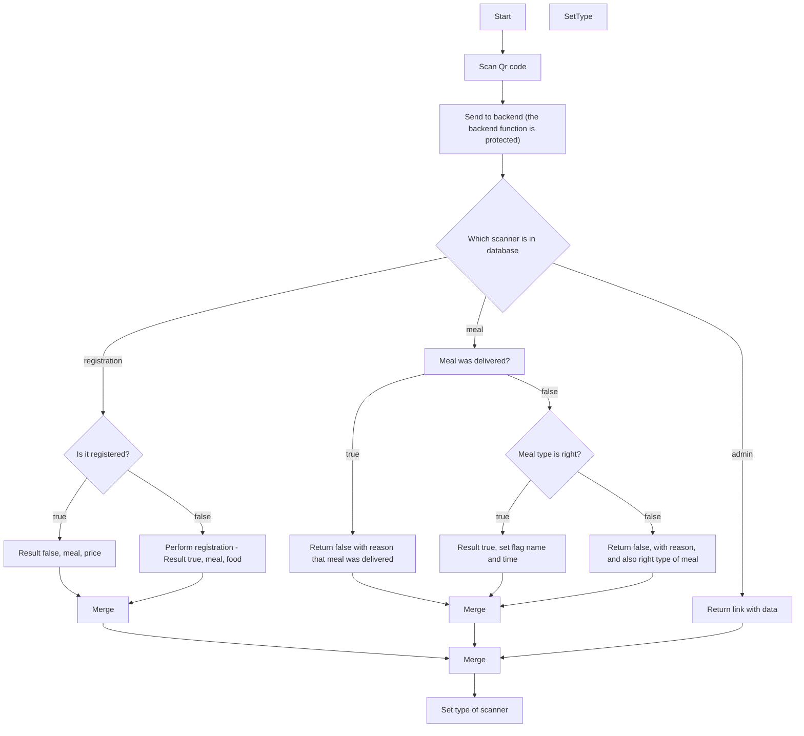

#Scannibg of the ticket diagram

```mermaid
flowchart TB
    START["Start"] --> ScanQr["Scan Qr code"]
    ScanQr --> SendToBackend["Send to backend (the backend function is protected)"]
    SendToBackend --> QScanType{"Which scanner is in database"}
    
    QScanType -- registration --> QisReg{"Is it registered?"}
    QisReg -- true --> ReturnRegInvalid["Result false, meal, price"]
    QisReg -- false --> PerformReg["Perform registration - Result true, meal, food"]
    ReturnRegInvalid --> RegMerge["Merge"]
    PerformReg --> RegMerge

    QScanType -- meal --> QmealDeliver["Meal was delivered?"]
    QmealDeliver -- true --> ReturnMealInvalid["Return false with reason that meal was delivered"]
    QmealDeliver -- false --> QRightMealType{"Meal type is right?"}
    QRightMealType -- true --> PerformDelivery["Result true, set flag name and time"]
    QRightMealType -- false --> ReturnTypeMealInvalid["Return false, with reason, and also right type of meal"]
    ReturnMealInvalid --> MealMerge["Merge"]
    PerformDelivery --> MealMerge
    ReturnTypeMealInvalid --> MealMerge

    QScanType -- admin --> ReturnAdmin["Return link with data"]

    RegMerge --> ScanMerge["Merge"]
    MealMerge --> ScanMerge
    ReturnAdmin --> ScanMerge
    ScanMerge --> SetTypeScan["Set type of scanner"]
    SetType
```
